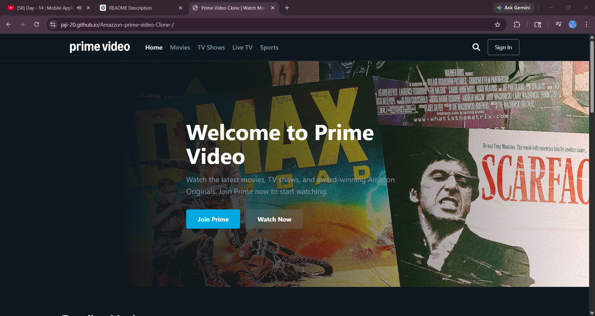
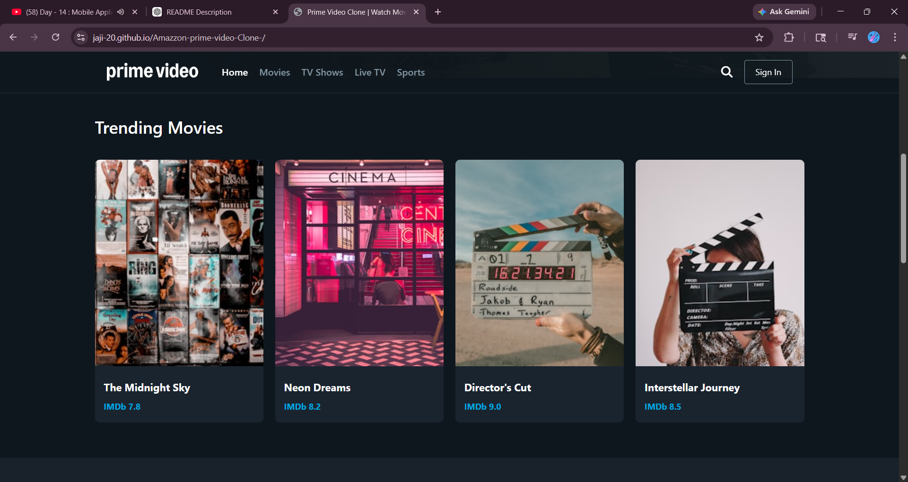
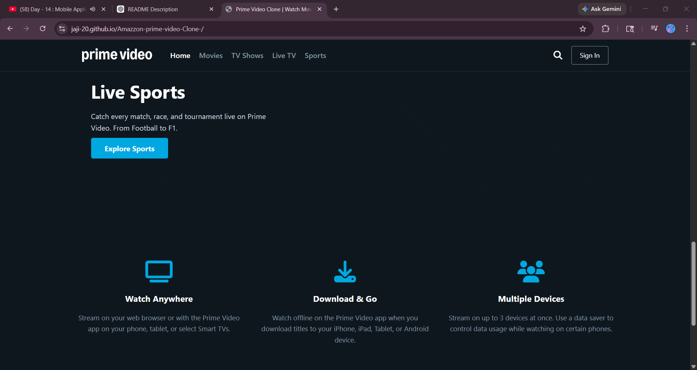
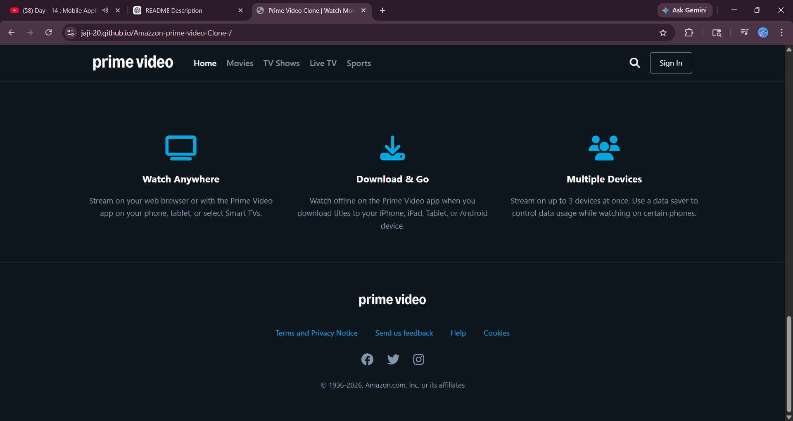

# Amazon Prime Video Clone 🎬

A responsive front-end clone of the Amazon Prime Video website built using HTML and CSS.

---

## 🚀 Features

- Responsive homepage design
- Modern navigation bar
- Movie and TV show sections
- Smooth hover effects
- Mobile-friendly layout
- Clean UI design

---

## 🛠️ Technologies Used

- HTML5
- CSS3

---

## 📂 Project Structure

Amazon-prime-video-Clone/
│
├── images/
├── index.html
├── style.css
└── README.md

---

## 📸 Screenshots

### 🏠 Home Page

### 🎬 Movies Page

### 📺 Popular Channels Page

### ⚽ Sports Page

### 📞 Contact & Enquiry Page

---

## 🎯 Purpose of the Project

This project was created to improve front-end web development skills by recreating a popular OTT streaming platform interface.

---

## 📱 Responsive Design

The website is optimized for:
- Desktop devices
- Tablets
- Mobile devices

---

## 🔥 Future Improvements

- Add JavaScript functionality
- Integrate video playback
- Add login/signup pages
- Fetch dynamic movie data using APIs

---

## 👨‍💻 Author

Developed by **Jaji-20**

---

## ⭐ Support

If you like this project, give it a ⭐ on GitHub!